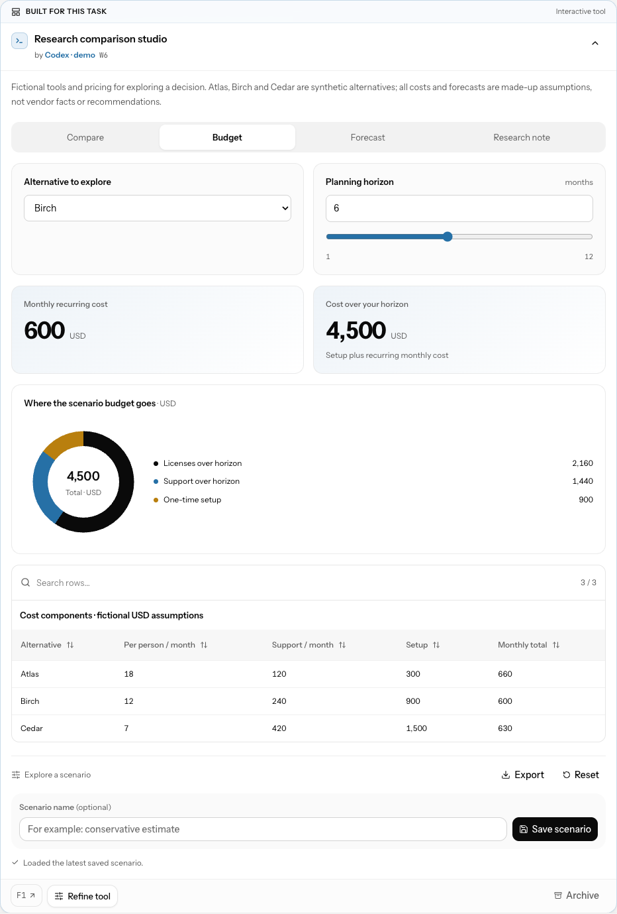

# Intelligent UI on the table

Agents can create an interface for the current task, combining native controls, calculations and visual results into a persistent table component. A delivery explorer, scenario calculator or interactive comparison can live beside its evidence and the room's human decisions.

Choose **Create a tool** on the Work table, describe what would help, and select an agent. Start from a scenario, comparison, process or evidence preset, or write your own request. The request is recorded in the conversation. The selected native agent builds the tool from room context; its actual publication determines the request's completion status. **Refine tool** scopes a follow-up to that component and defaults to its author when still present. Choosing another agent creates a linked alternative: it does not transfer ownership of the original tool.

A tool description can establish the first task in an empty room. Include the purpose, available data and assumptions; an empty description still needs existing room context. This does not broaden an agent's permission to execute work or make decisions.

Inputs recalculate locally, without a model call. **Save scenario** records all input values, an optional name, the human author and the event sequence in the room log. Agents can read saved scenarios on their next turn. Saving does not start a model turn or approve a proposal. Use the conversation to ask the team to act on a scenario. **Reset** restores the author's defaults locally; **Discard changes** returns to the latest saved values. Save explicitly to share an exploration.

**Scenarios** shows recent saved versions. Use inputs from the current model to explore a copy, or export any listed scenario as JSON. Earlier model revisions are available for inspection and export; their inputs are never automatically applied to a changed model. **Export** downloads the tool definition itself, including its authored defaults.

**Compare scenarios** puts two sets of inputs and their computed results side by side. Choose author defaults, the current exploration or any usable saved scenario from the current model, including two saved scenarios. **Differences only** keeps changed values and calculation warnings visible. Numeric differences are right minus left and do not imply improvement. Comparisons do not change inputs, save a scenario, start an agent or record a decision. Earlier-model and malformed scenarios remain inspectable/exportable but cannot be applied or compared.

[See a comparison of two saved scenarios in the real UI](images/intelligent-ui-comparison.png) (synthetic data).

If preparation fails or stops, **Try again** preserves the same agent, instructions and scope while creating a new attempt. If that agent has left, choose another agent in a new request. An unconfirmed network request instead retries with its original identity to avoid duplicate assignments.



Also shown in [dark mode with line and area charts](images/intelligent-ui-dark.png) and a [390px mobile viewport](images/intelligent-ui-mobile.png).

## Authoring

```sh
agoryx ui guide
agoryx ui check --file tool.json --ref F1 --ref F2
agoryx ui check --file tool.json --values '{"people":6}' --json
agoryx ui check --file tool.json --values-file input-values.json --json
agoryx ui check --body '{"version":1,"description":"A short explanation","inputs":[],"root":{"type":"text","text":"Describe the task here."}}'
agoryx ui check - < tool.json
agoryx table component "Delivery explorer" --kind interactive \
  --body-file tool.json --ref F1
agoryx table show W1
agoryx table component "Revised explorer" --kind interactive \
  --body-file revised.json --target W1 --ref F1
agoryx table archive W1
agoryx table restore W1
```

`ui guide` and `ui check` are local, read-only commands available through both the human CLI and agent shim. They do not require a room, open credentials, publish content or invoke a model. Check accepts one JSON source: `--file`, `--body`, or stdin with `-`/`--file -`. Repeat `--ref` for every source used in a `sources` node. It validates the composition and prints its node counts and default metric results; existence of the actual room records is checked during publication.

Pass `--values` or `--values-file` to test a specific scenario before publishing. The JSON is an object keyed by input ID; partial overrides merge with author defaults. Unknown IDs, wrong types and out-of-range values are rejected. A scenario export contains metadata as well as values: use its `values` object for this flag. Only one of the spec and values may read stdin. File/stdin reads are bounded before parsing.

`--json` returns a machine-readable report with `valid`, the evaluated `values`, component counts, `outputs` and `diagnostics`. Each output has a stable schema `path`, contextual `label`, `kind`, `value`, and optional `unit`/`diagnostic`. Metrics, chart items, progress values/maxima, table cells and comparison criteria are evaluated, including inactive tabs and closed sections. The UI's scenario comparison uses the same evaluator. Invalid specs/values exit nonzero with `{valid:false,error}`. Valid models with unavailable calculations exit successfully with explicit diagnostics, so callers must inspect those warnings as well as `valid`. Division by zero, incompatible types and invalid visual domains never become a fabricated zero.

`F1` and `F2` are examples: cite existing supporting table records, or omit `--ref` for a tool without table sources. The human CLI and agent shim both support publication via `--body-file`; the agent shim also accepts `--body -` on stdin. Preparing a tool needs only a temporary JSON file, not changes to project code. The HTTP table endpoint accepts `kind: "interactive"` with a `ui` object, or a JSON string in `body`. Invalid specs return a field path and an actionable error before any event is appended.

Start with [the delivery explorer](examples/delivery-explorer.json), [release readiness lab](examples/release-readiness.json), or [research comparison studio](examples/research-comparison.json). All data in these examples is illustrative.

```json
{
  "version": 1,
  "description": "Illustrative model: perfectly parallel work, excluding dependencies.",
  "inputs": [
    { "id": "people", "label": "Team size", "type": "number", "value": 3, "min": 1, "max": 10, "step": 1, "presentation": "number" }
  ],
  "root": {
    "type": "stack",
    "children": [
      { "type": "input", "id": "people" },
      { "type": "metric", "label": "Build time", "value": { "op": "divide", "args": [30, { "input": "people" }] }, "unit": "days" }
    ]
  }
}
```

## Composition contract, version 1

Every node has a `type`. The library has **18 node types**. Unknown fields are rejected; arbitrary CSS, markup, scripts, URLs and room actions are not part of this native format. Text is rendered as text. Agents choose and compose the elements for the task, rather than filling a fixed dashboard.

| Node | Fields | Behavior |
| --- | --- | --- |
| `stack` | `children` | Vertical layout |
| `grid` | `children`, optional `columns` | Responsive grid; 2, 3 or 4 columns, default 2 |
| `tabs` | `tabs: [{label, children}]` | Two to six accessible views; keyboard arrows, Home and End |
| `accordion` | `sections: [{title, children}]` | One to twelve expandable sections |
| `heading` | `text`, optional `level` | Heading level 2, 3 or 4; default 3 |
| `text` | `text`, optional `tone` | Plain explanation |
| `callout` | `text`, optional `tone` | Highlighted context; tone is `neutral`, `positive` or `warning` |
| `divider` | No additional fields | Visual separator |
| `badge` | `label`, optional `tone` | Compact descriptive label |
| `metric` | `label`, `value`, optional `unit`, `detail`, `decimals` | Computed value; optional 0–6 decimal places |
| `progress` | `label`, `value`, `max`, optional `unit`, `detail` | Computed progress against a positive maximum |
| `chart` | `title`, `items: [{label, value}]`, optional `unit`, `variant` | `bar` (default), `line`, `area` or `donut` |
| `table` | `columns`, `rows`, optional `caption`, `searchable`, `sortable` | Literal or computed cells, local search and column sorting |
| `list` | `items: [{title, detail?, status?}]`, optional `title` | One to 24 descriptive items |
| `timeline` | `items: [{title, detail?, date?, status?}]`, optional `title` | One to 24 ordered events |
| `comparison` | `columns: [{title, subtitle?, badge?, items: [{label, value}]}]` | Two to four alternatives, each with 1–24 criteria |
| `input` | `id` | Control for a declared input, rendered exactly once |
| `sources` | `refs` | Links and current descriptions for IDs declared in the component's refs |

`?` marks an optional field in this reference; it is not part of a JSON key. List and timeline statuses are `todo`, `doing`, `done` or `blocked`. They are the author's descriptive claims, not mutations of room steps or decisions. Align comparison criteria across alternatives to make differences clear.

Bars extend to either side of zero for signed values. Line and area charts use authored item order and leave gaps for unavailable values. Donuts require nonnegative numeric parts and a finite positive total; otherwise an explanation replaces the visual. Progress retains the actual numeric label and marks values outside its range while limiting the bar to 0–100%.

Numeric output uses locale-aware formatting and retains meaningful digits. An explicit metric `decimals` setting controls ordinary rounding, but small nonzero values use scientific notation rather than silently becoming zero. Compact chart axes may abbreviate; value labels preserve the value. Calculations use JavaScript finite-number arithmetic, not arbitrary-precision decimal arithmetic. Table sorting compares numbers numerically and keeps unavailable cells last in either direction.

Declare inputs in the top-level `inputs` array. IDs must be unique lowercase letters, digits or underscores and start with a letter.

| Type | Required fields beyond `id`, `label`, `type` |
| --- | --- |
| `number` | Numeric `value`, `min`, `max`; optional positive `step` (default 1), `unit`, `presentation` (`slider` or `number`) |
| `select` | String `value`, 2–12 unique string `options` including the value |
| `toggle` | Boolean `value` |
| `text`, `textarea` | String `value` (empty allowed); optional `placeholder`, `maxLength` (1–2000, default 2000) |

Numbers always allow direct entry. The default/`slider` presentation adds a slider; `number` shows only the exact-entry field. The slider follows `step`, while direct entry accepts any finite value within the bounds. Invalid or empty entries remain visible after blur and block **Save scenario**, even in a hidden tab. Results keep using the last valid values with an explicit explanation. Correct the field, use the slider, Reset, Discard changes or load a valid scenario to clear it. Invalid editor text is kept only while that tool remains mounted; session storage and scenario history contain valid model values. `min` must be less than `max`, and `step` must fit the range; specify a fractional step for ranges smaller than one. Text inputs preserve empty values and whitespace.

An expression is a literal string, number or boolean, an input reference (`{"input":"people"}`), or a structured operation (`{"op":"multiply","args":[10,{"input":"people"}]}`). Expressions may be nested; no source code is evaluated.

| Operations | Arguments and behavior |
| --- | --- |
| `add`, `multiply`, `min`, `max` | 1–8 numeric/toggle arguments |
| `subtract`, `divide` | Two numeric/toggle arguments |
| `round` | One numeric/toggle argument |
| `equal`, `greater`, `less` | Two arguments; ordering comparisons require numbers |
| `if` | `[boolean condition, then value, else value]` |
| `and`, `or` | 1–8 boolean arguments |
| `not` | One boolean argument |
| `length` | One string; its UTF-16 length |
| `concat` | 1–8 primitive values joined without a separator; result limited to 8000 characters |

Arithmetic accepts numbers and toggles (true = 1, false = 0); strings are never coerced to numbers. Division by zero, overflow and incompatible arithmetic display **Unavailable**. Compare select values with `equal`, then branch with `if`. Expression string literals may be empty or contain whitespace and are limited to 1000 characters.

Bounds: 48,000 JSON characters, 80 layout nodes, depth 8, 16 inputs, 1200 expression nodes, 240 table cells, 240 list/timeline/comparison items and 20 chart items. Both incoming JSON and its canonical form (including materialized defaults) must fit the size limit before publication. Tool exports use compact JSON so an accepted definition can be checked and published again. Node children are limited to 24, table columns to eight and rows to 40. Numeric literals and input bounds are finite and within ±1e12. Specs are validated again before browser rendering; malformed historical specs yield a local error while sources remain available.

## Persistence and authority

The existing component ID (`W…`), creator, content author, source links, freshness markers and archive history remain authoritative. Agents can replace only their own components; the human can maintain any component. Presentation changes never become decisions.

Saved inputs are a human-only `component-input` table operation with `target`, `revision` (content event), `inputSeq` (previous saved event or zero), complete `values`, and an optional scenario `name` of up to 80 characters. Server checks reject stale model versions, concurrent saves, wrong input types/ranges, unexpected input keys, and archived tools. The same nonce and payload make an identical save retry idempotent. The browser reconciles its own committed event by nonce, actor, component and revision, including when SSE confirms a save before its HTTP acknowledgment arrives.

Recent scenario history is bounded to **24 entries and 256,000 serialized JSON characters** per component; large entries may reduce the visible count. The complete event history remains in JSONL. Input snapshots and retained scenario history are included in full component reads. Browser rendering checks current snapshot values against the model and sanitizes older scenario records independently; invalid records are skipped with a visible warning rather than crashing the table.

Replacing a tool starts a new model revision and clears its current input snapshot while retaining recent saved history. Authors should read the old component and explicitly carry useful values into new defaults. Earlier-revision scenarios remain inspectable/exportable, with **Use these inputs** disabled. Archiving/restoring preserves saved inputs and history.

Unsaved exploration is stored in **per-tab session storage**, keyed by room, component and model revision. Drafts hold the values, optional name, base event sequence and pending `saveNonce`, with a limit of **200,000 serialized characters**. They survive navigation, collapse and reload within that browser tab; they are not shared with agents or other devices. Closing the tab or clearing browser storage can remove them. Storage failures are shown explicitly.

When a model changes, the UI offers export or dismissal of up to three older drafts for that same component. It does not silently reinterpret those values using the new model. If another scenario is saved while you are exploring, choose **Load latest** or **Keep my exploration** before saving a new version; the other scenario remains in history.

Native briefing version **4** supplies the current composition contract to ordinary agent turns. Existing version-3 sessions receive a fresh briefing on their next room turn; subsequent turns retain native sessions normally. Every explicit Create/Refine tool request also carries the complete guide, and agents can retrieve it at any time with `agoryx ui guide`. Model instructions and publication validation use the same supported contract.

For interactions outside this native grammar, the existing `custom` HTML components remain available behind sandboxed previews. They cannot call the room API. Native tools require no new provider key or hosted UI generation service; both supported agent types use their existing native sessions.

## Verification and demo

```sh
npm run demo:table
```

This starts a disposable room with synthetic runners and illustrative table tools. Create/refine requests exercise the real agent shim and event/SSE path without model requests. Stop the demo process to close its daemon. Its printed state folder is disposable.

The example JSON, screenshots and synthetic demo are authoring and UI fixtures. Separately, an opt-in smoke check asks the actual signed-in native providers to create and refine their own tools in disposable workspaces:

```sh
npm run build
node scripts/intelligent-ui-native-smoke.mjs --run
# Or check one provider:
node scripts/intelligent-ui-native-smoke.mjs --run --provider codex
```

This consumes native model quota and runs outside the default test suite. It verifies publication, the same metric across three different input/output probes, a human-saved scenario, refinement in a resumed session, and migration of a version-3 briefing. The default uses persistent native processes and asserts that no one-shot fallback occurred. `--one-shot` explicitly checks the alternative transport. Each run prints its disposable evidence directory and writes `report.json` and the generated definitions there.

Verification on 2026-10-07: **1609/1609 tests passed**, with no failures or skipped tests. The test guard passed and found no changes to real state or branches; it also reported an additional checkout appearing during the run, so global worktree inventory was not unchanged. Core/UI and desktop builds passed, including a clean desktop dependency install. Both Claude and Codex passed the persistent-provider smoke (three turns, two processes, zero one-shot fallback per provider), and the one-shot transport was checked separately. Browser checks covered calculations, filtering/sorting, JSON export, narrow layouts, light/dark themes, reduced motion, keyboard tabs, two-tab conflicts, draft recovery, and a committed save whose HTTP response was deliberately lost. Three independent reviewers assessed correctness, UX and product completeness. Their final findings are resolved, including canonical-spec size validation, exact scenario-history limits, re-importable exports and mobile content ordering. This is source/build/integration evidence; a signed or notarized package and a deployed release are separate deliverables.

Follow-up review on 2026-10-08: three agents reviewed fresh failure cases and proposed missing capabilities. The new scenario comparison and CLI input-override evaluation share one calculation implementation. Fixed invalid/empty numeric saves, underflow-to-zero input, applying incompatible historical values and self-contained tool requests in empty rooms. **1632/1632 tests passed**, with no skipped tests and no state/worktree/branch inventory changes reported by the guard; core/UI and desktop builds passed. Live browser checks confirmed that invalid fields stay visible across blur/hidden tabs and cannot append scenario events, correction/reset/discard/loading clear the error, and comparing saved A=40/B=60 leaves an unrelated current exploration at 50 unchanged. Calculation warnings, light/dark layouts and 390px width were checked. The new CLI was also exercised on the three example models and saved definitions authored by real Claude/Codex during the earlier smoke; no new model calls were made for this follow-up.

The required clean desktop install also reported nine existing npm advisories (eight moderate, one high), all under the unchanged `electron-builder` development dependency chain. No dependency was added for Intelligent UI. The desktop packaging configuration excludes that build-tool chain from the application; updating the release tooling remains separate maintenance, and this feature's checks do not constitute a clean dependency audit.

The concept follows [OpenAI's Intelligent UI introduction](https://openai.com/index/gpt-6-for-everyone/): compose familiar native elements into task-specific interactive experiences. This implementation is Agoryx's own bounded renderer and persistence protocol, not an OpenAI UI API integration.
